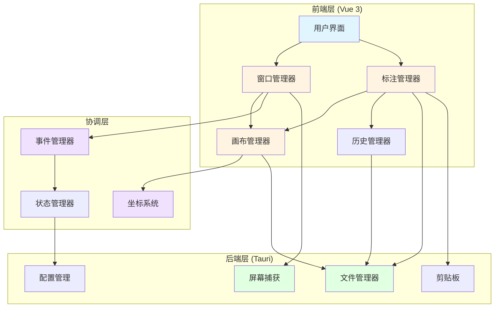
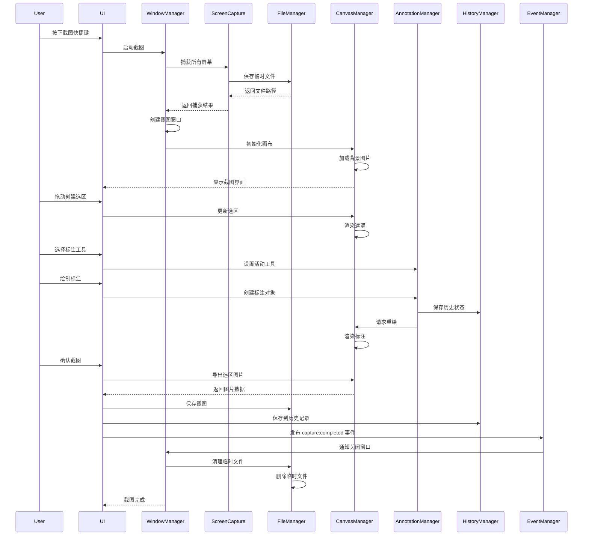
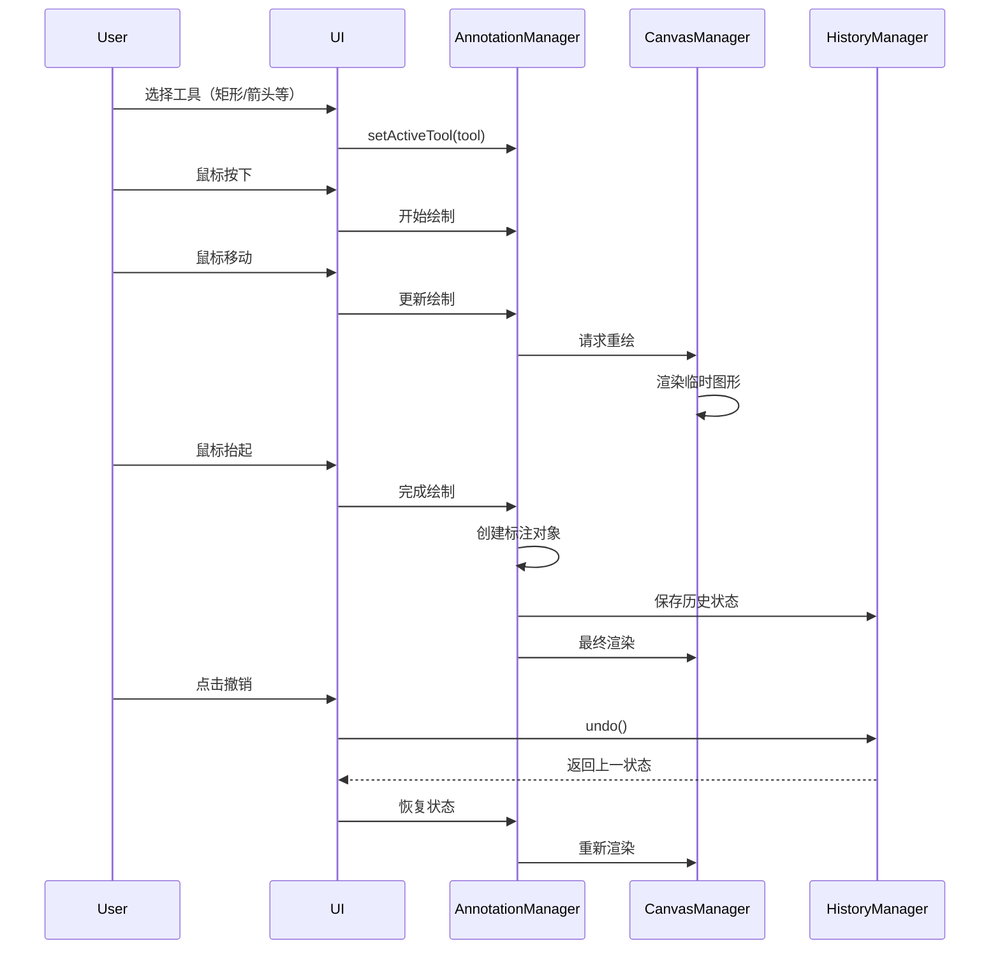
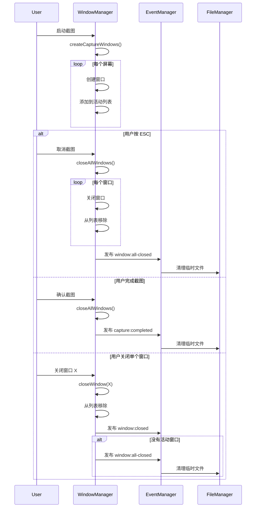

# 设计文档 - 截图工具改进

## 概述

本设计文档描述了截图工具改进项目的技术架构和实现方案。该项目基于 Tauri v2 + Vue 3 + Fabric.js 技术栈，旨在解决现有截图工具的多个关键问题，包括窗口生命周期管理、临时文件清理、坐标系统统一、性能优化等。

### 设计目标

1. **稳定性**: 确保多屏幕环境下窗口和资源的正确管理
2. **性能**: 优化渲染和事件处理，提供流畅的用户体验
3. **可维护性**: 简化架构，提高代码质量和可测试性
4. **跨平台**: 保证在 Windows、macOS 和 Linux 上的一致体验
5. **可扩展性**: 为未来功能扩展提供良好的架构基础

### 技术栈

- **前端框架**: Vue 3 (Composition API)
- **UI 框架**: Tauri v2
- **画布库**: Fabric.js (部分功能) + 原生 Canvas API
- **语言**: TypeScript
- **构建工具**: Vite
- **代码质量**: ESLint + Prettier

## 架构

### 系统架构图



### 分层架构

系统采用三层架构设计：

1. **前端层**: 负责用户交互和视图渲染
   - 用户界面组件
   - 窗口管理器 (WindowManager)
   - 画布管理器 (CanvasManager)
   - 标注管理器 (AnnotationManager)
   - 历史管理器 (HistoryManager)

2. **协调层**: 负责业务逻辑协调和状态管理
   - 坐标系统 (CoordinateSystem)
   - 事件管理器 (EventManager)
   - 状态管理器 (StateManager)

3. **后端层**: 负责系统级操作和资源管理
   - 屏幕捕获 (ScreenCapture)
   - 文件管理器 (FileManager)
   - 配置管理 (ConfigManager)
   - 剪贴板操作 (Clipboard)

### 核心设计原则

1. **单一职责**: 每个模块只负责一个明确的功能领域
2. **依赖倒置**: 高层模块不依赖低层模块，都依赖抽象接口
3. **事件驱动**: 使用事件总线解耦模块间通信
4. **资源管理**: 明确的资源生命周期和清理机制
5. **错误隔离**: 错误不应跨模块传播，每个模块独立处理错误

## 组件和接口

### 1. 窗口管理器 (WindowManager)

负责管理所有截图窗口的生命周期。

#### 职责

- 创建和销毁截图窗口
- 维护活动窗口列表
- 处理窗口关闭事件
- 协调多窗口操作

#### 接口定义

```typescript
interface CaptureWindow {
  id: string;
  label: string;
  screenIndex: number;
  handle: WebviewWindow;
}

interface WindowManager {
  // 创建所有屏幕的截图窗口
  createCaptureWindows(): Promise<CaptureWindow[]>;
  
  // 关闭所有窗口
  closeAllWindows(): Promise<void>;
  
  // 关闭指定窗口
  closeWindow(windowId: string): Promise<void>;
  
  // 获取活动窗口列表
  getActiveWindows(): CaptureWindow[];
  
  // 检查是否还有活动窗口
  hasActiveWindows(): boolean;
  
  // 注册窗口关闭回调
  onWindowClosed(callback: (windowId: string) => void): void;
}
```

#### 实现要点

- 使用 Map 存储窗口引用，键为窗口 ID
- 窗口关闭时从 Map 中移除引用
- 所有窗口关闭后触发清理事件
- 错误处理：单个窗口关闭失败不影响其他窗口

### 2. 文件管理器 (FileManager)

负责临时文件和持久化文件的管理。

#### 职责

- 创建和删除临时文件
- 管理临时文件列表
- 清理过期文件
- 保存截图到指定位置

#### 接口定义

```typescript
interface TempFile {
  path: string;
  createdAt: number;
  screenIndex: number;
}

interface FileManager {
  // 创建临时文件并记录
  createTempFile(screenIndex: number, data: Uint8Array): Promise<string>;
  
  // 删除指定临时文件
  deleteTempFile(path: string): Promise<void>;
  
  // 删除所有临时文件
  deleteAllTempFiles(): Promise<void>;
  
  // 清理过期文件（超过24小时）
  cleanupExpiredFiles(): Promise<void>;
  
  // 保存截图到指定路径
  saveScreenshot(data: Uint8Array, path: string, format: ImageFormat): Promise<void>;
  
  // 获取临时目录路径
  getTempDirectory(): Promise<string>;
}

type ImageFormat = 'png' | 'jpg' | 'webp';
```

#### 实现要点

- 使用专用临时目录（系统临时目录 + 应用标识）
- 维护临时文件列表（内存 + 持久化）
- 应用启动时清理过期文件
- 应用退出时清理所有临时文件
- 文件操作失败时记录日志但不抛出异常

### 3. 坐标系统 (CoordinateSystem)

负责处理逻辑像素和物理像素之间的转换。

#### 职责

- 存储每个屏幕的 DPI 缩放因子
- 提供坐标转换函数
- 处理多显示器坐标计算

#### 接口定义

```typescript
interface ScreenInfo {
  index: number;
  x: number;          // 逻辑坐标
  y: number;          // 逻辑坐标
  width: number;      // 逻辑尺寸
  height: number;     // 逻辑尺寸
  scaleFactor: number; // DPI 缩放因子
}

interface Point {
  x: number;
  y: number;
}

interface Rectangle {
  x: number;
  y: number;
  width: number;
  height: number;
}

interface CoordinateSystem {
  // 初始化屏幕信息
  initScreens(screens: ScreenInfo[]): void;
  
  // 逻辑像素转物理像素
  logicalToPhysical(point: Point, screenIndex: number): Point;
  
  // 物理像素转逻辑像素
  physicalToLogical(point: Point, screenIndex: number): Point;
  
  // 矩形坐标转换
  logicalRectToPhysical(rect: Rectangle, screenIndex: number): Rectangle;
  physicalRectToLogical(rect: Rectangle, screenIndex: number): Rectangle;
  
  // 获取屏幕信息
  getScreenInfo(screenIndex: number): ScreenInfo | null;
  
  // 获取所有屏幕信息
  getAllScreens(): ScreenInfo[];
  
  // 根据逻辑坐标查找所属屏幕
  findScreenByLogicalPoint(point: Point): ScreenInfo | null;
}
```

#### 实现要点

- 使用 Map 存储屏幕信息，键为屏幕索引
- 坐标转换公式：`physical = logical * scaleFactor`
- 坐标转换公式：`logical = physical / scaleFactor`
- 处理边界情况：坐标超出屏幕范围时进行裁剪
- 多显示器场景：考虑屏幕的相对位置偏移
- 提供类型安全的转换函数，避免混用坐标类型

### 4. 画布管理器 (CanvasManager)

负责管理截图画布的渲染和交互。

#### 职责

- 初始化和管理多个画布层
- 渲染背景截图
- 渲染选区遮罩
- 渲染标注内容
- 处理画布坐标转换
- 优化画布渲染性能

#### 接口定义

```typescript
interface CanvasLayer {
  canvas: HTMLCanvasElement;
  context: CanvasRenderingContext2D;
  type: 'background' | 'mask' | 'annotation' | 'magnifier';
}

interface SelectionRegion {
  x: number;      // 物理像素
  y: number;      // 物理像素
  width: number;  // 物理像素
  height: number; // 物理像素
}

interface CanvasManager {
  // 初始化画布
  initCanvas(
    backgroundCanvas: HTMLCanvasElement,
    maskCanvas: HTMLCanvasElement,
    annotationCanvas: HTMLCanvasElement,
    magnifierCanvas: HTMLCanvasElement
  ): void;
  
  // 设置背景图片
  setBackgroundImage(imageUrl: string): Promise<void>;
  
  // 渲染选区遮罩
  renderMask(selection: SelectionRegion | null): void;
  
  // 渲染放大镜
  renderMagnifier(position: Point, visible: boolean): void;
  
  // 获取指定位置的像素颜色
  getPixelColor(position: Point): { r: number; g: number; b: number; hex: string };
  
  // 清除所有画布
  clearAll(): void;
  
  // 导出选区图片为 DataURL
  exportSelection(selection: SelectionRegion): string;
  
  // 获取画布尺寸
  getCanvasSize(): { width: number; height: number };
}
```

#### 实现要点

- 使用多层画布架构：背景层、遮罩层、标注层、放大镜层
- 背景层：只渲染一次，不频繁更新
- 遮罩层：渲染半透明遮罩和选区边框
- 标注层：使用 Fabric.js 或原生 Canvas API 渲染标注
- 放大镜层：独立画布，避免影响主画布性能
- 使用离屏画布缓存背景图片，减少重绘
- 使用 `willReadFrequently` 选项优化 getImageData 性能
- 使用 requestAnimationFrame 批量处理渲染请求

### 5. 标注管理器 (AnnotationManager)

负责管理所有标注工具和标注对象。

#### 职责

- 管理标注工具状态
- 创建和编辑标注对象
- 处理标注工具交互
- 实现马赛克和模糊效果
- 管理标注样式配置

#### 接口定义

```typescript
type AnnotationTool = 'rect' | 'ellipse' | 'arrow' | 'pen' | 'text' | 'mosaic' | 'blur' | null;

interface AnnotationStyle {
  strokeColor: string;
  strokeWidth: number;
  fillColor: string;
  fontSize?: number;
  fontStyle?: 'normal' | 'bold' | 'italic';
  arrowStyle?: 'single' | 'double';
  mosaicSize?: number;
  blurStrength?: number;
}

interface Annotation {
  id: string;
  type: AnnotationTool;
  data: any; // 具体数据结构取决于工具类型
  style: AnnotationStyle;
  createdAt: number;
}

interface AnnotationManager {
  // 设置当前工具
  setActiveTool(tool: AnnotationTool): void;
  
  // 获取当前工具
  getActiveTool(): AnnotationTool;
  
  // 创建标注对象
  createAnnotation(type: AnnotationTool, data: any, style: AnnotationStyle): Annotation;
  
  // 更新标注对象
  updateAnnotation(id: string, data: any): void;
  
  // 删除标注对象
  deleteAnnotation(id: string): void;
  
  // 获取所有标注对象
  getAllAnnotations(): Annotation[];
  
  // 清除所有标注
  clearAll(): void;
  
  // 设置标注样式
  setStyle(style: Partial<AnnotationStyle>): void;
  
  // 获取当前样式
  getStyle(): AnnotationStyle;
  
  // 应用马赛克效果
  applyMosaic(region: Rectangle, size: number): void;
  
  // 应用模糊效果
  applyBlur(region: Rectangle, strength: number): void;
}
```

#### 实现要点

- 使用工厂模式创建不同类型的标注对象
- 马赛克实现：将区域分块，每块取平均颜色填充
- 模糊实现：使用高斯模糊算法或 CSS filter
- 标注对象使用唯一 ID 标识
- 样式配置独立于标注对象，便于批量修改
- 支持标注对象的序列化和反序列化
- 使用观察者模式通知画布更新

### 6. 历史管理器 (HistoryManager)

负责管理撤销/重做历史记录和截图历史。

#### 职责

- 管理标注操作的撤销/重做栈
- 保存和加载截图历史
- 管理历史记录的持久化
- 限制历史记录数量

#### 接口定义

```typescript
interface HistoryEntry {
  timestamp: number;
  state: string; // JSON 序列化的画布状态
}

interface ScreenshotHistoryItem {
  id: string;
  thumbnail: string; // Base64 缩略图
  fullImage: string; // 完整图片路径
  width: number;
  height: number;
  createdAt: number;
  annotations: Annotation[];
}

interface HistoryManager {
  // 撤销/重做操作
  saveState(state: string): void;
  undo(): string | null;
  redo(): string | null;
  canUndo(): boolean;
  canRedo(): boolean;
  clearHistory(): void;
  
  // 截图历史管理
  saveScreenshot(item: ScreenshotHistoryItem): Promise<void>;
  getScreenshotHistory(): Promise<ScreenshotHistoryItem[]>;
  deleteScreenshot(id: string): Promise<void>;
  clearScreenshotHistory(): Promise<void>;
  
  // 历史记录限制
  setMaxHistorySize(size: number): void;
  getHistorySize(): number;
}
```

#### 实现要点

- 使用双栈结构实现撤销/重做：历史栈 + 重做栈
- 历史栈最大容量 50 条，超出时删除最旧记录
- 新操作发生时清空重做栈
- 截图历史最多保存 20 条
- 使用防抖机制减少历史记录保存频率（300ms）
- 截图历史持久化到本地存储（IndexedDB 或文件系统）
- 缩略图尺寸限制为 200x200px，减少存储空间

### 7. 事件管理器 (EventManager)

负责模块间的事件通信。

#### 职责

- 提供事件发布/订阅机制
- 解耦模块间依赖
- 管理事件监听器生命周期

#### 接口定义

```typescript
type EventType = 
  | 'window:closed'
  | 'window:all-closed'
  | 'selection:created'
  | 'selection:updated'
  | 'selection:confirmed'
  | 'selection:cancelled'
  | 'annotation:created'
  | 'annotation:updated'
  | 'annotation:deleted'
  | 'tool:changed'
  | 'capture:started'
  | 'capture:completed'
  | 'capture:failed'
  | 'file:cleanup-requested';

interface EventPayload {
  [key: string]: any;
}

interface EventManager {
  // 发布事件
  emit(event: EventType, payload?: EventPayload): void;
  
  // 订阅事件
  on(event: EventType, handler: (payload?: EventPayload) => void): () => void;
  
  // 订阅一次性事件
  once(event: EventType, handler: (payload?: EventPayload) => void): void;
  
  // 取消订阅
  off(event: EventType, handler: (payload?: EventPayload) => void): void;
  
  // 清除所有监听器
  clear(): void;
}
```

#### 实现要点

- 使用 Map 存储事件监听器，键为事件类型
- 返回取消订阅函数，便于清理
- 支持事件优先级（可选）
- 错误处理：监听器抛出异常不影响其他监听器
- 提供调试模式，记录所有事件流

### 8. 状态管理器 (StateManager)

负责管理应用全局状态。

#### 职责

- 管理截图会话状态
- 管理用户配置状态
- 提供状态变更通知
- 状态持久化

#### 接口定义

```typescript
interface CaptureSession {
  id: string;
  screenIndex: number;
  startTime: number;
  selection: SelectionRegion | null;
  annotations: Annotation[];
  activeTool: AnnotationTool;
  style: AnnotationStyle;
}

interface AppState {
  // 当前截图会话
  currentSession: CaptureSession | null;
  
  // 活动窗口列表
  activeWindows: CaptureWindow[];
  
  // 临时文件列表
  tempFiles: TempFile[];
  
  // 用户配置
  config: AppConfig;
  
  // 性能指标
  performanceMetrics: PerformanceMetrics;
}

interface StateManager {
  // 获取状态
  getState(): AppState;
  
  // 更新状态
  setState(updates: Partial<AppState>): void;
  
  // 订阅状态变更
  subscribe(callback: (state: AppState) => void): () => void;
  
  // 重置状态
  reset(): void;
  
  // 持久化状态
  persist(): Promise<void>;
  
  // 加载持久化状态
  load(): Promise<void>;
}
```

#### 实现要点

- 使用响应式状态管理（Vue ref/reactive）
- 状态变更触发订阅回调
- 部分状态持久化到本地存储
- 提供状态快照功能用于调试
- 使用不可变更新模式，避免状态污染

### 9. 性能监控模块 (PerformanceMonitor)

负责监控和记录性能指标。

#### 职责

- 记录关键操作耗时
- 监控内存使用
- 计算渲染帧率
- 生成性能报告

#### 接口定义

```typescript
interface PerformanceMetrics {
  captureTime: number;      // 截图捕获耗时 (ms)
  encodeTime: number;       // 图片编码耗时 (ms)
  renderFPS: number;        // 画布渲染帧率
  memoryUsage: number;      // 内存使用 (MB)
  annotationCount: number;  // 标注对象数量
  historySize: number;      // 历史记录大小
}

interface PerformanceMonitor {
  // 开始计时
  startTimer(label: string): void;
  
  // 结束计时并记录
  endTimer(label: string): number;
  
  // 记录内存使用
  recordMemoryUsage(): void;
  
  // 记录帧率
  recordFrame(): void;
  
  // 获取性能指标
  getMetrics(): PerformanceMetrics;
  
  // 导出性能报告
  exportReport(): string;
  
  // 重置指标
  reset(): void;
  
  // 检查性能异常
  checkAnomalies(): string[];
}
```

#### 实现要点

- 使用 `performance.now()` 进行高精度计时
- 使用 `performance.memory` API 监控内存（Chrome）
- 使用滑动窗口计算平均帧率（最近 60 帧）
- 性能异常阈值：捕获 > 500ms，编码 > 200ms，FPS < 30
- 开发模式下在控制台输出性能指标
- 生产模式下只记录异常情况

### 10. 配置管理器 (ConfigManager)

负责管理用户配置和快捷键。

#### 职责

- 加载和保存配置
- 管理快捷键绑定
- 检测快捷键冲突
- 提供配置验证

#### 接口定义

```typescript
interface ShortcutConfig {
  startCapture: string;      // 启动截图
  confirmCapture: string;    // 确认截图
  cancelCapture: string;     // 取消截图
  toolRect: string;          // 矩形工具
  toolEllipse: string;       // 椭圆工具
  toolArrow: string;         // 箭头工具
  toolPen: string;           // 画笔工具
  toolText: string;          // 文字工具
  toolMosaic: string;        // 马赛克工具
  toolBlur: string;          // 模糊工具
  undo: string;              // 撤销
  redo: string;              // 重做
}

interface SaveOptions {
  defaultFormat: ImageFormat;
  defaultQuality: number;     // 0-100
  defaultPath: string;
  autoSave: boolean;
  copyToClipboard: boolean;
}

interface AppConfig {
  shortcuts: ShortcutConfig;
  saveOptions: SaveOptions;
  maxHistorySize: number;
  maxScreenshotHistory: number;
  language: string;
  theme: string;
}

interface ConfigManager {
  // 加载配置
  loadConfig(): Promise<AppConfig>;
  
  // 保存配置
  saveConfig(config: AppConfig): Promise<void>;
  
  // 更新部分配置
  updateConfig(updates: Partial<AppConfig>): Promise<void>;
  
  // 重置为默认配置
  resetToDefaults(): Promise<void>;
  
  // 验证快捷键
  validateShortcut(shortcut: string): boolean;
  
  // 检测快捷键冲突
  detectShortcutConflicts(shortcuts: ShortcutConfig): string[];
  
  // 获取默认配置
  getDefaults(): AppConfig;
}
```

#### 实现要点

- 配置文件使用 JSON 格式存储
- 配置路径：`~/.clipboard-manager/screenshot-config.json`
- 快捷键格式：`Ctrl+Shift+A`、`Cmd+Shift+A` 等
- 快捷键冲突检测：检查是否有重复绑定
- 配置验证：检查路径是否存在、快捷键格式是否正确
- 提供配置迁移机制，兼容旧版本配置

### 11. 后端屏幕捕获 (ScreenCapture - Rust)

负责捕获屏幕内容。

#### 职责

- 获取所有屏幕信息
- 并行捕获多个屏幕
- 编码图片为 PNG 格式
- 优化捕获性能

#### 接口定义 (Rust)

```rust
pub struct ScreenInfo {
    pub id: u32,
    pub x: i32,
    pub y: i32,
    pub width: u32,
    pub height: u32,
    pub scale_factor: f64,
    pub is_primary: bool,
}

pub struct CaptureResult {
    pub id: u32,
    pub path: String,
    pub x: i32,
    pub y: i32,
    pub width: u32,
    pub height: u32,
    pub scale_factor: f64,
}

pub trait ScreenCapture {
    // 获取所有屏幕信息
    fn get_all_screens() -> Result<Vec<ScreenInfo>, String>;
    
    // 捕获所有屏幕
    fn capture_all_screens(temp_dir: PathBuf) -> Result<Vec<CaptureResult>, String>;
    
    // 捕获指定屏幕
    fn capture_screen(screen_id: u32, temp_dir: PathBuf) -> Result<CaptureResult, String>;
    
    // 编码图片
    fn encode_image(data: &[u8], width: u32, height: u32, format: ImageFormat) -> Result<Vec<u8>, String>;
}
```

#### 实现要点

- 使用 `screenshots` crate 进行屏幕捕获
- 使用 `std::thread::scope` 实现并行捕获
- 使用 `image` crate 进行图片编码
- 使用 `BufWriter` 优化文件写入性能
- 记录每个屏幕的捕获耗时
- 错误处理：单个屏幕捕获失败不影响其他屏幕

### 12. 后端文件管理器 (FileManager - Rust)

负责后端文件操作。

#### 职责

- 管理临时文件列表
- 清理过期文件
- 保存截图文件
- 处理文件路径

#### 接口定义 (Rust)

```rust
pub struct TempFile {
    pub path: PathBuf,
    pub created_at: SystemTime,
    pub screen_index: u32,
}

pub struct FileManager {
    temp_files: Arc<Mutex<Vec<TempFile>>>,
    temp_dir: PathBuf,
}

impl FileManager {
    // 创建文件管理器
    pub fn new(temp_dir: PathBuf) -> Self;
    
    // 添加临时文件记录
    pub fn add_temp_file(&self, path: PathBuf, screen_index: u32);
    
    // 删除临时文件
    pub fn delete_temp_file(&self, path: &Path) -> Result<(), String>;
    
    // 删除所有临时文件
    pub fn delete_all_temp_files(&self) -> Result<(), String>;
    
    // 清理过期文件
    pub fn cleanup_expired_files(&self, max_age: Duration) -> Result<usize, String>;
    
    // 保存截图
    pub fn save_screenshot(&self, data: &[u8], path: &Path, format: ImageFormat) -> Result<(), String>;
    
    // 获取临时目录
    pub fn get_temp_dir(&self) -> &Path;
}
```

#### 实现要点

- 使用 `Arc<Mutex<Vec<TempFile>>>` 保护临时文件列表
- 临时目录：`系统临时目录/clipboard-manager-screenshots/`
- 文件名格式：`screenshot_{screen_id}_{timestamp}.png`
- 过期时间：24 小时
- 启动时自动清理过期文件
- 应用退出时注册清理钩子

## 数据模型

### 前端数据模型

```typescript
// 截图捕获结果
interface CaptureResult {
  id: number;
  path: string;
  x: number;
  y: number;
  width: number;
  height: number;
  scale_factor: number;
}

// 颜色信息
interface ColorInfo {
  r: number;
  g: number;
  b: number;
  hex: string;
}

// 工具栏位置
interface ToolbarPosition {
  left: string;
  top: string;
}

// 放大镜配置
interface MagnifierConfig {
  size: number;        // 放大镜尺寸
  zoomLevel: number;   // 放大倍数
  visible: boolean;
}
```

### 后端数据模型 (Rust)

```rust
// 图片格式
pub enum ImageFormat {
    Png,
    Jpg,
    Webp,
}

// 错误类型
pub enum ScreenshotError {
    CaptureError(String),
    EncodeError(String),
    FileError(String),
    WindowError(String),
}

// 配置数据
pub struct ScreenshotConfig {
    pub shortcuts: HashMap<String, String>,
    pub save_options: SaveOptions,
    pub max_history_size: usize,
}
```

## 数据流

### 截图流程序列图


标注操作流程



窗口生命周期流程


### 错误处理策略
#### 错误分类
1. 可恢复错误：不影响核心功能，可以继续操作
- 单个屏幕捕获失败
- 临时文件删除失败
- 历史记录保存失败
- 不可恢复错误：需要终止当前操作

2. 所有屏幕捕获失败
- 画布初始化失败
- 内存不足

3. 用户错误：需要用户干预
- 磁盘空间不足
- 文件权限不足
- 快捷键冲突

#### 错误处理原则
```
// 1. 所有异步操作使用 try-catch
async function captureScreens() {
  try {
    const results = await invoke('capture_all_screens');
    return results;
  } catch (error) {
    console.error('Screen capture failed:', error);
    showErrorToast('截图失败，请重试');
    throw error; // 向上传播不可恢复错误
  }
}

// 2. 错误日志记录
function logError(context: string, error: Error) {
  const errorInfo = {
    context,
    message: error.message,
    stack: error.stack,
    timestamp: Date.now(),
  };
  console.error('[Screenshot Error]', errorInfo);
  // 可选：发送到错误追踪服务
}

// 3. 用户友好的错误提示
function showErrorToast(message: string) {
  // 显示简短的错误提示
  toast.error(message, { duration: 3000 });
}

// 4. 错误恢复机制
async function captureWithRetry(maxRetries = 3) {
  for (let i = 0; i < maxRetries; i++) {
    try {
      return await captureScreens();
    } catch (error) {
      if (i === maxRetries - 1) throw error;
      await sleep(1000 * (i + 1)); // 指数退避
    }
  }
}
```
### Rust 错误处理
```rust
// 使用 Result 类型处理错误
pub fn capture_screen(screen_id: u32) -> Result<CaptureResult, ScreenshotError> {
    let screen = Screen::from_point(0, 0)
        .map_err(|e| ScreenshotError::CaptureError(e.to_string()))?;
    
    let image = screen.capture()
        .map_err(|e| ScreenshotError::CaptureError(e.to_string()))?;
    
    // ... 处理图片
    
    Ok(result)
}

// 错误传播
pub fn capture_all_screens() -> Result<Vec<CaptureResult>, ScreenshotError> {
    let screens = Screen::all()
        .map_err(|e| ScreenshotError::CaptureError(e.to_string()))?;
    
    let mut results = Vec::new();
    let mut errors = Vec::new();
    
    for screen in screens {
        match capture_single_screen(screen) {
            Ok(result) => results.push(result),
            Err(e) => {
                log::error!("Failed to capture screen: {}", e);
                errors.push(e);
            }
        }
    }
    
    // 如果所有屏幕都失败，返回错误
    if results.is_empty() && !errors.is_empty() {
        return Err(ScreenshotError::CaptureError(
            "All screens failed to capture".to_string()
        ));
    }
    
    Ok(results)
}
```
#### 正确性属性
基于需求文档，定义以下正确性属性用于 Property-Based Testing：

**属性 1: 坐标转换的可逆性**
```typescript
// 逻辑像素 -> 物理像素 -> 逻辑像素 应该得到原始值
property('coordinate conversion is reversible', () => {
  const logical = { x: randomInt(0, 1920), y: randomInt(0, 1080) };
  const screenIndex = 0;
  const scaleFactor = 2.0;
  
  const physical = coordinateSystem.logicalToPhysical(logical, screenIndex);
  const result = coordinateSystem.physicalToLogical(physical, screenIndex);
  
  return Math.abs(result.x - logical.x) < 0.01 && 
         Math.abs(result.y - logical.y) < 0.01;
});
```
属性 2: 窗口管理的一致性
```typescript
// 创建的窗口数量应该等于屏幕数量
property('window count equals screen count', async () => {
  const screens = await getScreens();
  const windows = await windowManager.createCaptureWindows();
  
  return windows.length === screens.length;
});

// 关闭所有窗口后，活动窗口列表应该为空
property('no active windows after close all', async () => {
  await windowManager.createCaptureWindows();
  await windowManager.closeAllWindows();
  
  return windowManager.getActiveWindows().length === 0;
});
```
属性 3: 临时文件清理的完整性
```typescript
// 所有创建的临时文件都应该被清理
property('all temp files are cleaned up', async () => {
  const initialFiles = await listTempFiles();
  
  await captureScreens();
  await completeCapture();
  
  const finalFiles = await listTempFiles();
  
  return finalFiles.length === initialFiles.length;
});

// 过期文件应该被清理
property('expired files are cleaned', async () => {
  const oldFile = await createTempFile(Date.now() - 25 * 3600 * 1000);
  
  await fileManager.cleanupExpiredFiles();
  
  const exists = await fileExists(oldFile);
  return !exists;
});
```
属性 4: 历史记录的边界
```typescript
// 历史记录不应超过最大限制
property('history size is bounded', () => {
  const maxSize = 50;
  historyManager.setMaxHistorySize(maxSize);
  
  // 添加 100 条记录
  for (let i = 0; i < 100; i++) {
    historyManager.saveState(`state_${i}`);
  }
  
  return historyManager.getHistorySize() <= maxSize;
});

// 撤销后重做应该恢复原状态
property('undo then redo restores state', () => {
  const initialState = 'state_1';
  historyManager.saveState(initialState);
  
  const newState = 'state_2';
  historyManager.saveState(newState);
  
  const undoState = historyManager.undo();
  const redoState = historyManager.redo();
  
  return redoState === newState;
});
```
属性 5: 标注操作的幂等性
```typescript
// 删除不存在的标注不应该改变状态
property('deleting non-existent annotation is idempotent', () => {
  const initialCount = annotationManager.getAllAnnotations().length;
  
  annotationManager.deleteAnnotation('non-existent-id');
  
  const finalCount = annotationManager.getAllAnnotations().length;
  return initialCount === finalCount;
});

// 设置相同的工具不应该触发状态变更
property('setting same tool is idempotent', () => {
  annotationManager.setActiveTool('rect');
  const tool1 = annotationManager.getActiveTool();
  
  annotationManager.setActiveTool('rect');
  const tool2 = annotationManager.getActiveTool();
  
  return tool1 === tool2 && tool1 === 'rect';
});
```
属性 6: 性能约束
```typescript
// 坐标转换应该在 1ms 内完成
property('coordinate conversion is fast', () => {
  const start = performance.now();
  
  for (let i = 0; i < 1000; i++) {
    coordinateSystem.logicalToPhysical({ x: i, y: i }, 0);
  }
  
  const duration = performance.now() - start;
  return duration < 1; // 1000 次转换应该在 1ms 内完成
});

// 画布渲染帧率应该 >= 30 FPS
property('canvas renders at acceptable FPS', async () => {
  const fps = await measureRenderFPS(1000); // 测量 1 秒
  return fps >= 30;
});
```
#### 实现注意事项
1. 性能优化
- 节流和防抖：鼠标移动事件使用节流（16ms），历史记录保存使用防抖（300ms）
- 离屏画布：使用离屏画布缓存背景图片，避免重复加载
- requestAnimationFrame：所有画布渲染操作使用 RAF 批量处理
- Web Worker：图片编码等耗时操作考虑使用 Worker
- 虚拟滚动：截图历史列表使用虚拟滚动，只渲染可见项
2. 内存管理
- 及时释放资源：画布、图片对象使用完毕后及时释放
- 限制缓存大小：历史记录、截图历史都有明确的数量限制
- 使用 WeakMap：对于临时引用使用 WeakMap，允许垃圾回收
- 监控内存使用：定期检查内存使用，超过阈值时清理缓存
3. 跨平台兼容性
- 条件编译：使用 #[cfg(target_os = "...")] 处理平台特定代码
- 降级策略：不支持的特性提供替代方案
- 路径处理：使用 std::path::PathBuf 处理跨平台路径
- 快捷键映射：Cmd (macOS) 和 Ctrl (Windows/Linux) 的映射
4. 错误处理
- 不要吞掉错误：所有错误都应该被记录
- 用户友好提示：技术错误转换为用户可理解的消息
- 错误恢复：提供重试机制和降级方案
- 错误追踪：记录错误上下文，便于调试
5. 测试策略
- 单元测试：每个模块独立测试，覆盖率 > 80%
- 集成测试：测试模块间交互和完整流程
- Property-Based Testing：使用正确性属性进行随机测试
- 性能测试：定期运行性能基准测试
- 跨平台测试：在所有支持的平台上测试
6. 代码质量
- 类型安全：避免使用 any，使用明确的类型定义
- 函数拆分：单个函数不超过 50 行，复杂度不超过 10
- 命名规范：使用描述性名称，遵循 TypeScript/Rust 命名约定
- 注释文档：所有公共 API 提供 JSDoc/Rustdoc 注释
- 代码审查：所有代码变更经过审查
7. 安全考虑
- 输入验证：验证所有用户输入和外部数据
- 路径安全：防止路径遍历攻击
- 权限检查：文件操作前检查权限
- 数据清理：敏感数据使用后及时清理
8. 可维护性
- 模块化设计：每个模块职责单一，低耦合高内聚
- 依赖注入：使用依赖注入便于测试和替换
- 配置外部化：可配置项不硬编码
- 版本兼容：考虑配置文件和数据格式的向后兼容

## 技术债务和未来改进

### 当前限制

1. **Fabric.js 依赖**：部分功能仍依赖 Fabric.js，增加了包体积
2. **单线程渲染**：画布渲染在主线程，可能阻塞 UI
3. **内存占用**：大尺寸截图和多个历史记录占用较多内存
4. **平台差异**：Windows/Linux 的窗口特性支持不如 macOS 完善

### 未来改进方向

1. **完全移除 Fabric.js**
   - 使用原生 Canvas API 实现所有标注功能
   - 减少包体积约 500KB
   - 提高渲染性能

2. **OffscreenCanvas 支持**
   - 将渲染移到 Worker 线程
   - 避免阻塞主线程
   - 需要浏览器支持

3. **WebAssembly 加速**
   - 图片处理（马赛克、模糊）使用 WASM
   - 提高处理速度 2-5 倍
   - 减少内存占用

4. **增量渲染**
   - 只重绘变化的区域
   - 使用脏矩形算法
   - 提高大画布性能

5. **云同步**
   - 截图历史云端同步
   - 多设备共享
   - 需要用户授权

6. **AI 功能**
   - 智能识别敏感信息自动打码
   - OCR 文字识别
   - 图片内容分类

7. **插件系统**
   - 支持第三方标注工具
   - 自定义导出格式
   - 扩展快捷键

## 部署和发布

### 构建配置

```json
// package.json
{
  "scripts": {
    "dev": "vite",
    "build": "vue-tsc --noEmit && vite build",
    "tauri:dev": "tauri dev",
    "tauri:build": "tauri build",
    "tauri:build:debug": "tauri build --debug",
    "lint": "eslint . --ext .ts,.tsx,.vue",
    "format": "prettier --write \"src/**/*.{ts,tsx,vue}\"",
    "test": "vitest",
    "test:ui": "vitest --ui"
  }
}
```

### 发布流程

1. **版本更新**
   - 更新 `package.json` 和 `Cargo.toml` 版本号
   - 更新 `CHANGELOG.md`
   - 创建 Git tag

2. **构建**
   - 运行 `pnpm tauri build`
   - 生成各平台安装包
   - 生成更新清单

3. **测试**
   - 在所有平台上测试安装包
   - 验证自动更新功能
   - 检查性能指标

4. **发布**
   - 上传到 GitHub Releases
   - 更新下载链接
   - 发布更新公告

### 自动更新配置

```json
// tauri.conf.json
{
  "updater": {
    "active": true,
    "endpoints": [
      "https://github.com/username/clipboard/releases/latest/download/latest.json"
    ],
    "dialog": true,
    "pubkey": "YOUR_PUBLIC_KEY"
  }
}
```

## 监控和诊断

### 性能监控

```typescript
// 开发模式下启用性能监控
if (import.meta.env.DEV) {
  const monitor = new PerformanceMonitor();
  
  // 监控关键操作
  monitor.startTimer('capture');
  await captureScreens();
  monitor.endTimer('capture');
  
  // 定期输出指标
  setInterval(() => {
    const metrics = monitor.getMetrics();
    console.table(metrics);
    
    // 检查异常
    const anomalies = monitor.checkAnomalies();
    if (anomalies.length > 0) {
      console.warn('Performance anomalies detected:', anomalies);
    }
  }, 5000);
}
```

### 错误追踪

```typescript
// 集成错误追踪服务（可选）
window.addEventListener('error', (event) => {
  logError('Uncaught error', event.error);
  // 可选：发送到 Sentry 等服务
});

window.addEventListener('unhandledrejection', (event) => {
  logError('Unhandled promise rejection', event.reason);
});
```

### 用户反馈

```typescript
// 提供反馈机制
interface FeedbackData {
  type: 'bug' | 'feature' | 'other';
  message: string;
  screenshot?: string;
  systemInfo: {
    os: string;
    version: string;
    screens: number;
  };
}

async function submitFeedback(data: FeedbackData) {
  // 收集系统信息
  const systemInfo = await getSystemInfo();
  
  // 可选：附加性能报告
  const performanceReport = performanceMonitor.exportReport();
  
  // 发送反馈
  await sendFeedback({
    ...data,
    systemInfo,
    performanceReport,
  });
}
```

## 文档和培训

### 用户文档

1. **快速入门指南**
   - 安装和配置
   - 基本操作流程
   - 常用快捷键

2. **功能详解**
   - 标注工具使用
   - 快捷键自定义
   - 保存选项配置

3. **常见问题**
   - 截图失败怎么办
   - 如何清理临时文件
   - 性能优化建议

4. **故障排除**
   - 窗口无法显示
   - 快捷键冲突
   - 文件保存失败

### 开发者文档

1. **架构文档**
   - 系统架构图
   - 模块职责说明
   - 数据流图

2. **API 文档**
   - 前端 API 参考
   - Rust API 参考
   - 事件列表

3. **贡献指南**
   - 代码规范
   - 提交流程
   - 测试要求

4. **调试指南**
   - 开发环境搭建
   - 调试技巧
   - 性能分析

## 总结

本设计文档详细描述了截图工具改进项目的技术架构和实现方案。主要设计要点包括：

### 核心架构

1. **三层架构**：前端层、协调层、后端层，职责清晰
2. **事件驱动**：使用事件总线解耦模块间通信
3. **资源管理**：明确的生命周期和清理机制

### 关键组件

1. **窗口管理器**：管理多屏幕截图窗口生命周期
2. **文件管理器**：自动清理临时文件，防止磁盘占用
3. **坐标系统**：统一处理逻辑像素和物理像素转换
4. **画布管理器**：优化渲染性能，支持多层画布
5. **标注管理器**：丰富的标注工具，包括马赛克和模糊
6. **历史管理器**：撤销/重做和截图历史管理

### 质量保证

1. **正确性属性**：定义 6 大类正确性属性用于 PBT
2. **错误处理**：完善的错误分类和处理策略
3. **性能优化**：节流、防抖、离屏画布、RAF 等优化手段
4. **跨平台支持**：处理平台差异，提供降级方案

### 可维护性

1. **类型安全**：使用 TypeScript 明确类型定义
2. **模块化设计**：单一职责，低耦合高内聚
3. **文档完善**：API 文档、架构文档、用户文档
4. **测试覆盖**：单元测试、集成测试、性能测试

该设计为实现一个功能完整、性能优秀、易于维护的截图工具提供了坚实的技术基础。

---

## 附录

### A. 快捷键列表

| 功能 | macOS | Windows/Linux |
|------|-------|---------------|
| 启动截图 | Cmd+Shift+A | Ctrl+Shift+A |
| 确认截图 | Enter | Enter |
| 取消截图 | Esc | Esc |
| 矩形工具 | R | R |
| 椭圆工具 | O | O |
| 箭头工具 | A | A |
| 画笔工具 | P | P |
| 文字工具 | T | T |
| 马赛克工具 | M | M |
| 模糊工具 | B | B |
| 撤销 | Cmd+Z | Ctrl+Z |
| 重做 | Cmd+Shift+Z | Ctrl+Shift+Z |

### B. 配置文件示例

```json
{
  "shortcuts": {
    "startCapture": "Ctrl+Shift+A",
    "confirmCapture": "Enter",
    "cancelCapture": "Escape",
    "toolRect": "R",
    "toolEllipse": "O",
    "toolArrow": "A",
    "toolPen": "P",
    "toolText": "T",
    "toolMosaic": "M",
    "toolBlur": "B",
    "undo": "Ctrl+Z",
    "redo": "Ctrl+Shift+Z"
  },
  "saveOptions": {
    "defaultFormat": "png",
    "defaultQuality": 90,
    "defaultPath": "~/Pictures/Screenshots",
    "autoSave": false,
    "copyToClipboard": true
  },
  "maxHistorySize": 50,
  "maxScreenshotHistory": 20,
  "language": "zh-CN",
  "theme": "auto"
}
```

### C. 性能基准

| 操作 | 目标时间 | 备注 |
|------|---------|------|
| 屏幕捕获 | < 500ms | 单屏幕 |
| 图片编码 | < 200ms | PNG 格式 |
| 画布渲染 | > 30 FPS | 持续渲染 |
| 坐标转换 | < 0.001ms | 单次转换 |
| 历史记录保存 | < 50ms | 单次保存 |
| 临时文件清理 | < 1s | 启动时 |

### D. 浏览器兼容性

| 特性 | Chrome | Firefox | Safari | Edge |
|------|--------|---------|--------|------|
| Canvas API | ✅ | ✅ | ✅ | ✅ |
| OffscreenCanvas | ✅ | ✅ | ❌ | ✅ |
| Performance API | ✅ | ✅ | ✅ | ✅ |
| IndexedDB | ✅ | ✅ | ✅ | ✅ |
| Web Workers | ✅ | ✅ | ✅ | ✅ |

### E. 依赖版本

**前端依赖**
- Vue: ^3.5.13
- TypeScript: ~5.6.2
- Fabric.js: ^7.1.0 (计划移除)
- Vite: ^6.0.3

**后端依赖**
- Tauri: ^2.0
- screenshots: latest
- image: latest
- tokio: ^1.0
